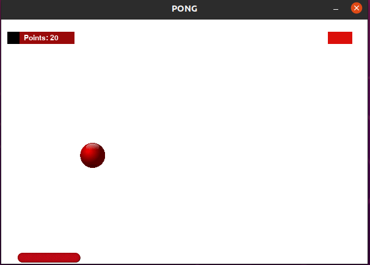

# PONG

> It's a simple application using pygame

    


This application is a version of Pong game created using pygame. 



## How to play:

The player gains points every time the ball touches the bar and loses energy every time the ball touches the bottom of the screen. You should use the left and right arrow to move the bar and the SPACE to restart the game.


## RUN :arrow_forward:

Make sure you have python and pygame installed at your computer.

```sh
python main.py
```
or 

```sh
python3 main.py
```

## Meta :raising_hand:

Tárcila Fernanda Resende da Silva – [@tarcila414]

:mailbox: &nbsp; [](https://www.linkedin.com/in/t%C3%A1rcila-silva-6756101a5/) [](mailto:tarcila086@gmail.com)

## Contributing :triangular_flag_on_post:

1. _Fork_ it (<https://github.com/tarcila414/PongGame/fork>)
2. Create your feature _branch_ (`git checkout -b feature/fooBar`)
3. _Commit_ your changes (`git commit -am 'Add some fooBar'`)
4. _Push_ to the branch (`git push origin feature/fooBar`)
5. Create a new _Pull Request_
